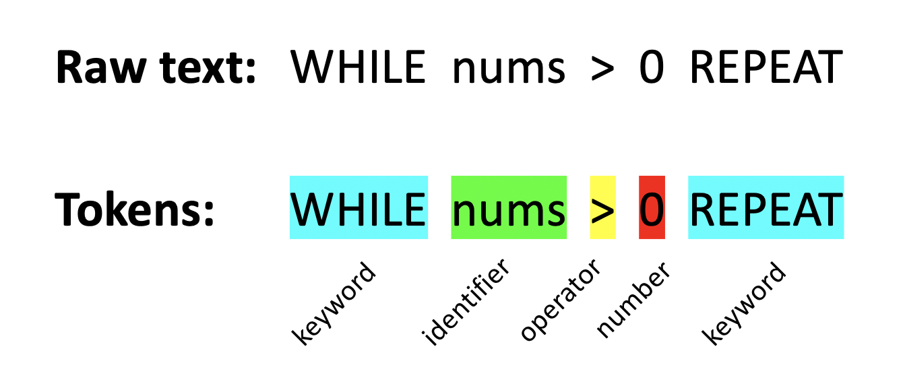

# Popo Compiler

Popo is a simple compiler only for educational purposes written in Python, it compiles a basic lang to C.

## How does it work?

Simply check out the photo below! If you want to know more, please check Resources.



## What it doesn't support

There are no functions, no arrays, no way to read/write from a file, and no else statement.

## Operators

Popo supports the following operators:

```
+ - \* / = == != > < >= <=
```

## Strings

Double quotation followed by zero or more characters and a double quotation. Such as:

```
"Hello, world!"
```

## Numbers

Currently, decimals are not supported.

## Identifiers

An alphabetical character followed by zero or more alphanumeric characters.

## Keywords

Exact text match of:

```
LABEL, GOTO, PRINT, INPUT, LET, IF, THEN, ENDIF, WHILE, REPEAT, ENDWHILE
```

## Resource

Thanks to [Austin Henley](https://github.com/AZHenley) for his great [article](http://web.eecs.utk.edu/~azh/blog/teenytinycompiler1.html)

Don't miss James Kyle's [Super Tiny Compiler](https://github.com/jamiebuilds/the-super-tiny-compiler)
